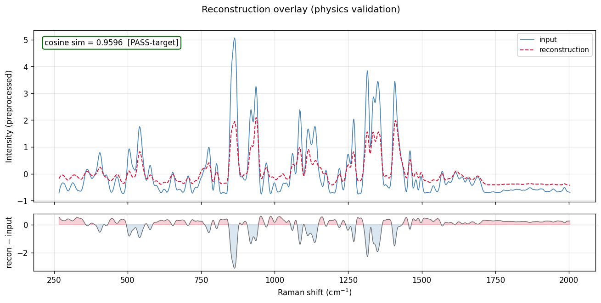
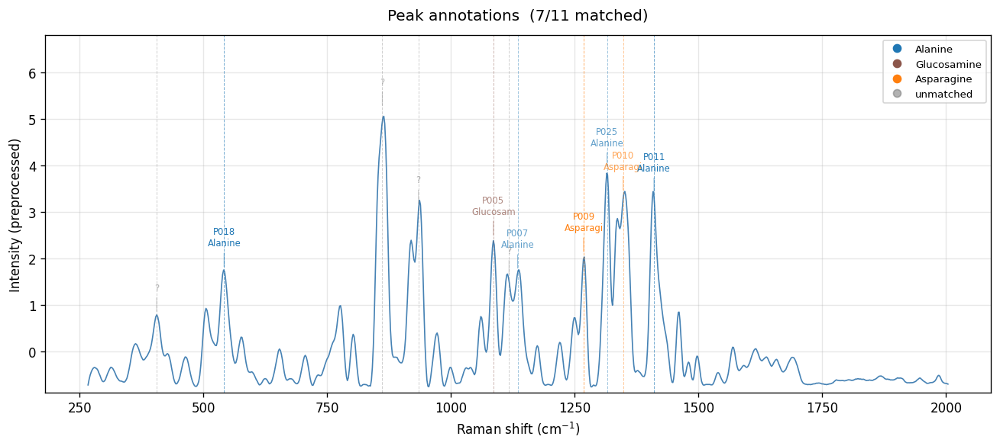
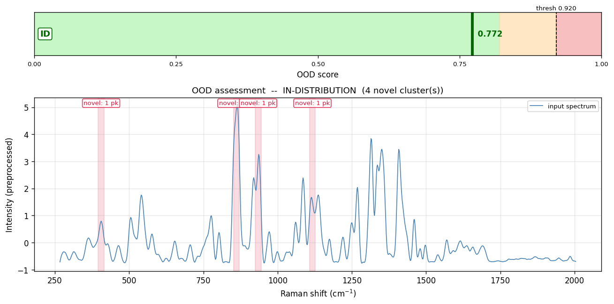

# Raman Spectrum Analysis Report

- **Sample ID:** `demo_2_mild_glucosamine_heavy`
- **Date:** 2026-05-14 15:52:39 UTC
- **Model Version:** v0.1.0-mvp
- **n MC samples:** 50

## 1. Composition Analysis

Composition predicted by the learned head (mean ± MC std), with the symbolic head's cross-check tag (per CHAT4_PHASE_AB_HANDOVER §D.3).

| Compound | Predicted (mean) | Uncertainty (±std) | Ground truth | Error | Symbolic vote | Cross-check |
|---|---|---|---|---|---|---|
| Alanine | 0.174 (17.4%) | ±0.009 | 0.129 | +0.045 | — | ⚠️ learned-only |
| Asparagine | 0.114 (11.4%) | ±0.009 | 0.022 | +0.092 | **1.0** | ✓ present |
| Aspartic Acid | 0.228 (22.8%) | ±0.010 | 0.172 | +0.056 | — | ⚠️ learned-only |
| Glutamic Acid | 0.220 (22.0%) | ±0.008 | 0.318 | -0.098 | — | ⚠️ learned-only |
| Histidine | 0.147 (14.7%) | ±0.010 | 0.151 | -0.004 | — | ⚠️ learned-only |
| Glucosamine | 0.117 (11.7%) | ±0.009 | 0.208 | -0.090 | 0.5 | ⚠️ learned-only |

**Symbolic head ⇒ likely present:** Asparagine.

**Uncertainty summary:** predictive entropy = 1.7551, mean compound std = 0.0092.

## 2. Peak Analysis

Detected **11 peaks**. **7** matched to known compounds, **4** unmatched.

| Position (cm⁻¹) | Intensity | FWHM | Bond / Mode | Compound | DB-id | Conf. | Δν |
|---|---|---|---|---|---|---|---|
| 405.7 | 0.812 | 13.4 | — | — | — | none | — |
| 541.9 | 1.773 | 16.7 | COO- bend / C-N-C bend | Alanine, Asparagine, Aspartic Acid, Glutamic Acid | P018 | high | +1.9 |
| 861.4 | 5.243 | 22.1 | — | — | — | none | — |
| 934.3 | 3.132 | 18.6 | — | — | — | none | — |
| 1085.8 | 2.454 | 12.2 | C-O stretch / pyranose ring | Glucosamine | P005 | medium | +5.8 |
| 1117.3 | 1.621 | 21.3 | — | — | — | none | — |
| 1134.7 | 1.742 | 20.2 | C-N stretch | Alanine, Asparagine, Aspartic Acid, Glutamic Acid | P007 | medium | +4.7 |
| 1268.2 | 2.099 | 10.4 | Amide III (N-H bend + C-N stretch) | Asparagine | P009 | high | +3.2 |
| 1315.3 | 3.932 | 13.9 | CH deformation | Alanine, Asparagine, Aspartic Acid, Glutamic Acid | P025 | medium | -4.7 |
| 1347.7 | 3.424 | 27.7 | CH2 wag | Asparagine, Aspartic Acid, Glutamic Acid | P010 | medium | +7.7 |
| 1410.3 | 3.391 | 16.1 | COO- symmetric stretch | Alanine, Asparagine, Aspartic Acid, Glutamic Acid, Histidine | P011 | high | +0.3 |

## 3. Physics Validation

- **Reconstruction cosine similarity:** 0.9596  (✓ PASS-target (≥ 0.95))
- The predicted composition reproduces the input spectrum well via the linear Beer-Lambert combination of pure references. Constraint satisfied.

## 4. OOD Assessment

- **OOD Score:** 0.7724  (threshold 0.9202)
- **Verdict:** ✓ IN-DISTRIBUTION
- **Components:** recon_norm = 1.000, var_norm = 0.431
- **Novel peaks:** 4 unmatched, grouped into 4 cluster(s).

**Cluster details:**
- cluster centroid 406 cm-1 (1 peak, span 0 cm-1): metal-X / heavy-atom stretches  --  M-S, M-O, M-Cl, M-N inorganic stretches; skeletal deformation
- cluster centroid 861 cm-1 (1 peak, span 0 cm-1): ring / skeletal stretches  --  alkane C-C, ring breathing of aromatics / heterocycles
- cluster centroid 934 cm-1 (1 peak, span 0 cm-1): C-C / C-O stretch  --  alkane C-C; alcohols / ethers C-O; sugar pyranose ring; P-O
- cluster centroid 1117 cm-1 (1 peak, span 0 cm-1): C-C, C-N, C-O stretches  --  alkyl C-N (amines); ester / ether C-O; aromatic C-H in-plane bend; sulfate S=O

## 5. Visualisations

## 6. Benchmark Context

On the same test split (Scheme-A composition-OOD, 540 rows):

| Model | Quant MAE | Notes |
|---|---|---|
| _(no benchmark numbers available yet)_ | -- | run T23/T24/T25 to populate `results/benchmark_table.json` |

**This sample's MAE: 0.0641**.
