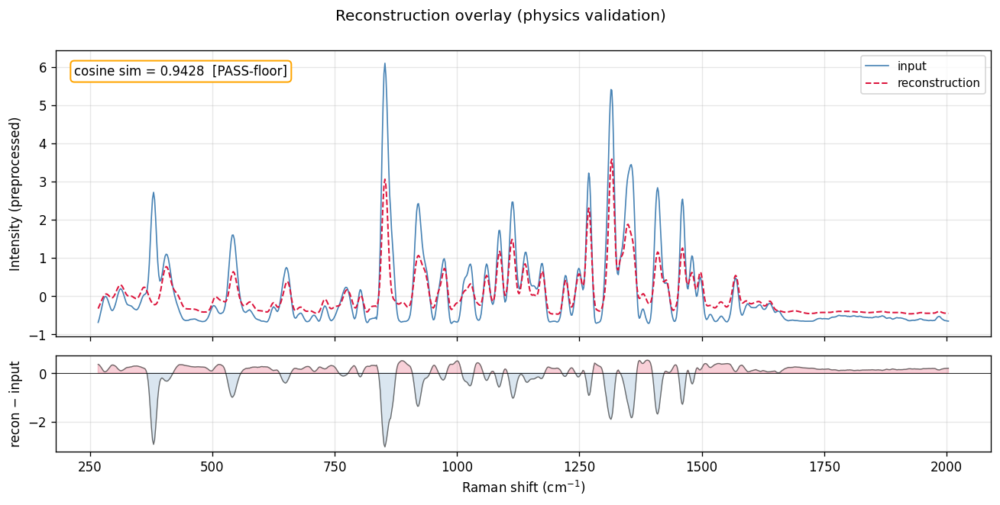
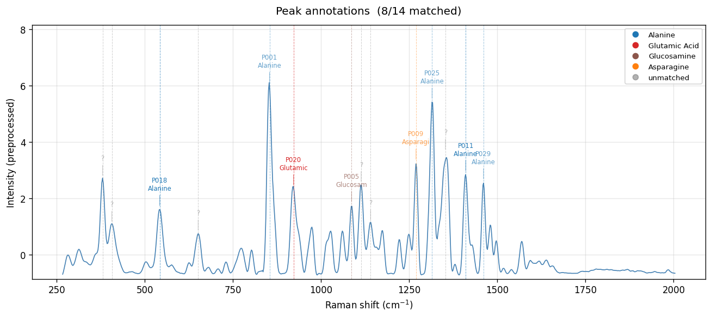
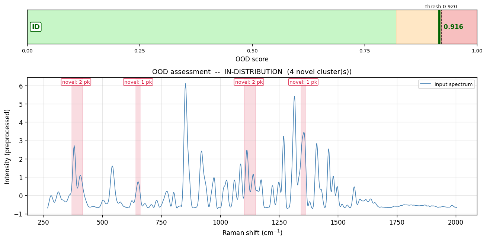

# Raman Spectrum Analysis Report

- **Sample ID:** `demo_3_hard_synthetic_mos2`
- **Date:** 2026-05-14 15:52:41 UTC
- **Model Version:** v0.1.0-mvp
- **n MC samples:** 50

## 1. Composition Analysis

Composition predicted by the learned head (mean ± MC std), with the symbolic head's cross-check tag (per CHAT4_PHASE_AB_HANDOVER §D.3).

| Compound | Predicted (mean) | Uncertainty (±std) | Symbolic vote | Cross-check |
|---|---|---|---|---|
| Alanine | 0.326 (32.6%) | ±0.020 | 0.5 | ⚠️ learned-only |
| Asparagine | 0.049 (4.9%) | ±0.015 | 0.5 | ✓ absent |
| Aspartic Acid | 0.052 (5.2%) | ±0.013 | — | ⚠️ learned-only |
| Glutamic Acid | 0.013 (1.3%) | ±0.005 | **1.0** | ⚠️ symbolic-only |
| Histidine | 0.408 (40.8%) | ±0.028 | — | ⚠️ learned-only |
| Glucosamine | 0.152 (15.2%) | ±0.016 | 0.5 | ⚠️ learned-only |

**Symbolic head ⇒ likely present:** Glutamic Acid.

**Uncertainty summary:** predictive entropy = 1.3771, mean compound std = 0.0163.

## 2. Peak Analysis

Detected **14 peaks**. **8** matched to known compounds, **6** unmatched.

| Position (cm⁻¹) | Intensity | FWHM | Bond / Mode | Compound | DB-id | Conf. | Δν |
|---|---|---|---|---|---|---|---|
| 380.3 | 2.748 | 13.2 | — | — | — | none | — |
| 406.4 | 1.117 | 19.0 | — | — | — | none | — |
| 542.5 | 1.677 | 14.5 | COO- bend / C-N-C bend | Alanine, Asparagine, Aspartic Acid, Glutamic Acid | P018 | high | +2.5 |
| 651.4 | 0.807 | 10.8 | — | — | — | none | — |
| 853.9 | 6.043 | 15.6 | C-COO- symmetric stretch / C-CH3 stretch | Alanine | P001 | medium | +3.9 |
| 922.1 | 2.408 | 16.8 | C-C-N stretch | Glutamic Acid | P020 | high | -2.9 |
| 1086.7 | 1.817 | 10.1 | C-O stretch / pyranose ring | Glucosamine | P005 | medium | +6.7 |
| 1113.7 | 2.530 | 12.9 | — | — | — | none | — |
| 1140.4 | 1.169 | 13.7 | — | — | — | none | — |
| 1269.3 | 3.320 | 10.1 | Amide III (N-H bend + C-N stretch) | Asparagine | P009 | medium | +4.3 |
| 1314.9 | 5.482 | 14.0 | CH deformation | Alanine, Asparagine, Aspartic Acid, Glutamic Acid | P025 | medium | -5.1 |
| 1352.7 | 3.675 | 19.5 | — | — | — | none | — |
| 1410.4 | 2.914 | 12.7 | COO- symmetric stretch | Alanine, Asparagine, Aspartic Acid, Glutamic Acid, Histidine | P011 | high | +0.4 |
| 1460.8 | 2.627 | 9.8 | NH3+ asymmetric deformation | Alanine, Asparagine, Aspartic Acid, Glutamic Acid, Histidine, Glucosamine | P029 | medium | +5.8 |

## 3. Physics Validation

- **Reconstruction cosine similarity:** 0.9428  (✓ PASS-floor (≥ 0.85))
- The predicted composition reproduces the input spectrum well via the linear Beer-Lambert combination of pure references. Constraint satisfied.

## 4. OOD Assessment

- **OOD Score:** 0.9158  (threshold 0.9202)
- **Verdict:** ✓ IN-DISTRIBUTION
- **Components:** recon_norm = 1.000, var_norm = 0.790
- **Novel peaks:** 6 unmatched, grouped into 4 cluster(s).

**Cluster details:**
- cluster centroid 388 cm-1 (2 peaks, span 26 cm-1): lattice / skeletal modes, metal-X / heavy-atom stretches  --  inorganic phonons (MoS2 E2g ~380, A1g ~408); metal-O stretches; framework breathing; M-S, M-O, M-Cl, M-N inorganic stretches; skeletal deformation
- cluster centroid 651 cm-1 (1 peak, span 0 cm-1): C-S, C-X bend; ring deformation  --  thiols, halogenated alkanes, aromatic ring deformation
- cluster centroid 1122 cm-1 (2 peaks, span 27 cm-1): C-C, C-N, C-O stretches  --  alkyl C-N (amines); ester / ether C-O; aromatic C-H in-plane bend; sulfate S=O
- cluster centroid 1353 cm-1 (1 peak, span 0 cm-1): CH bending / COO- symmetric stretch  --  aliphatic CH2/CH3 deformation; carboxylate sym stretch; amide III in proteins

## 5. Visualisations

## 6. Benchmark Context

On the same test split (Scheme-A composition-OOD, 540 rows):

| Model | Quant MAE | Notes |
|---|---|---|
| _(no benchmark numbers available yet)_ | -- | run T23/T24/T25 to populate `results/benchmark_table.json` |
