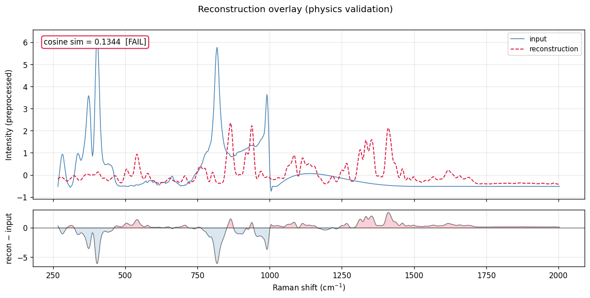
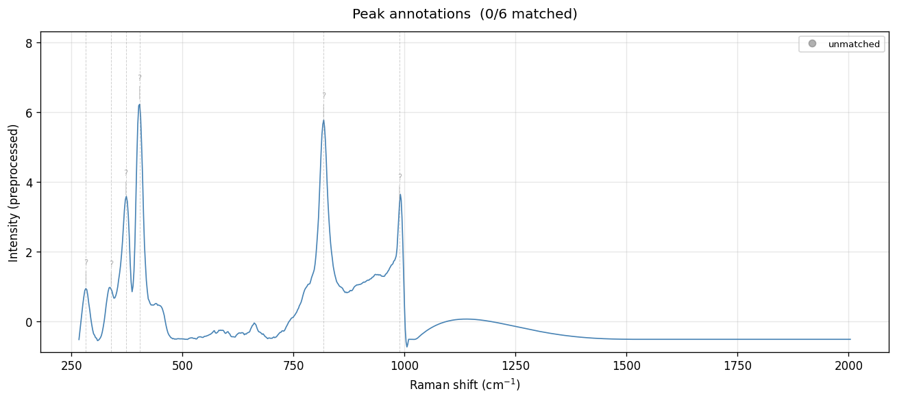
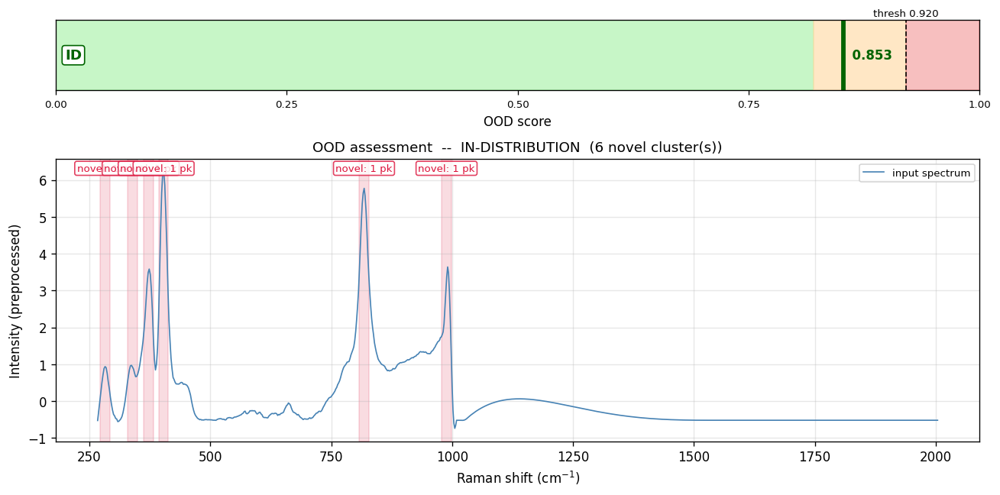

# Raman Spectrum Analysis Report

- **Sample ID:** `demo_3_real_mos2`
- **Date:** 2026-05-21 09:02:12 UTC
- **Model Version:** v0.1.0-mvp
- **n MC samples:** 50

## 1. Composition Analysis

Composition predicted by the learned head (mean ± MC std), with the symbolic head's cross-check tag (per CHAT4_PHASE_AB_HANDOVER §D.3).

| Compound | Predicted (mean) | Uncertainty (±std) | Symbolic vote | Cross-check |
|---|---|---|---|---|
| Alanine | 0.112 (11.2%) | ±0.011 | — | ⚠️ learned-only |
| Asparagine | 0.168 (16.8%) | ±0.012 | — | ⚠️ learned-only |
| Aspartic Acid | 0.196 (19.6%) | ±0.012 | — | ⚠️ learned-only |
| Glutamic Acid | 0.287 (28.7%) | ±0.015 | — | ⚠️ learned-only |
| Histidine | 0.087 (8.7%) | ±0.012 | — | ⚠️ learned-only |
| Glucosamine | 0.150 (15.0%) | ±0.010 | — | ⚠️ learned-only |

**Symbolic head ⇒ no compounds reached the vote threshold.**  (See peak table for individual matches.)

**Uncertainty summary:** predictive entropy = 1.7194, mean compound std = 0.0122.

## 2. Peak Analysis

Detected **6 peaks**. **0** matched to known compounds, **6** unmatched.

| Position (cm⁻¹) | Intensity | FWHM | Bond / Mode | Compound | DB-id | Conf. | Δν |
|---|---|---|---|---|---|---|---|
| 282.8 | 0.994 | 12.3 | — | — | — | none | — |
| 339.6 | 0.964 | 21.8 | — | — | — | none | — |
| 372.7 | 3.565 | 19.8 | — | — | — | none | — |
| 403.5 | 6.305 | 17.7 | — | — | — | none | — |
| 817.8 | 5.784 | 24.1 | — | — | — | none | — |
| 988.6 | 3.457 | 16.5 | — | — | — | none | — |

## 3. Physics Validation

- **Reconstruction cosine similarity:** 0.1344  (✗ Floor missed)
- The predicted composition cannot reproduce the input spectrum (cosine sim below floor 0.85). **Constraint violated** -- this prediction should be treated with extreme caution.

## 4. OOD Assessment

- **OOD Score:** 0.8526  (threshold 0.9202)
- **Verdict:** ✓ IN-DISTRIBUTION
- **Components:** recon_norm = 1.000, var_norm = 0.632
- **Novel peaks:** 6 unmatched, grouped into 6 cluster(s).

**Cluster details:**
- cluster centroid 283 cm-1 (1 peak, span 0 cm-1): lattice / skeletal modes  --  inorganic phonons (MoS2 E2g ~380, A1g ~408); metal-O stretches; framework breathing
- cluster centroid 340 cm-1 (1 peak, span 0 cm-1): lattice / skeletal modes, metal-X / heavy-atom stretches  --  inorganic phonons (MoS2 E2g ~380, A1g ~408); metal-O stretches; framework breathing; M-S, M-O, M-Cl, M-N inorganic stretches; skeletal deformation
- cluster centroid 373 cm-1 (1 peak, span 0 cm-1): lattice / skeletal modes, metal-X / heavy-atom stretches  --  inorganic phonons (MoS2 E2g ~380, A1g ~408); metal-O stretches; framework breathing; M-S, M-O, M-Cl, M-N inorganic stretches; skeletal deformation
- cluster centroid 403 cm-1 (1 peak, span 0 cm-1): metal-X / heavy-atom stretches  --  M-S, M-O, M-Cl, M-N inorganic stretches; skeletal deformation
- cluster centroid 818 cm-1 (1 peak, span 0 cm-1): ring / skeletal stretches  --  alkane C-C, ring breathing of aromatics / heterocycles
- cluster centroid 989 cm-1 (1 peak, span 0 cm-1): C-C / C-O stretch  --  alkane C-C; alcohols / ethers C-O; sugar pyranose ring; P-O

## 5. Visualisations

## 6. Benchmark Context

On the same test split (Scheme-A composition-OOD, 540 rows):

| Model | Quant MAE | Notes |
|---|---|---|
| _(no benchmark numbers available yet)_ | -- | run T23/T24/T25 to populate `results/benchmark_table.json` |
